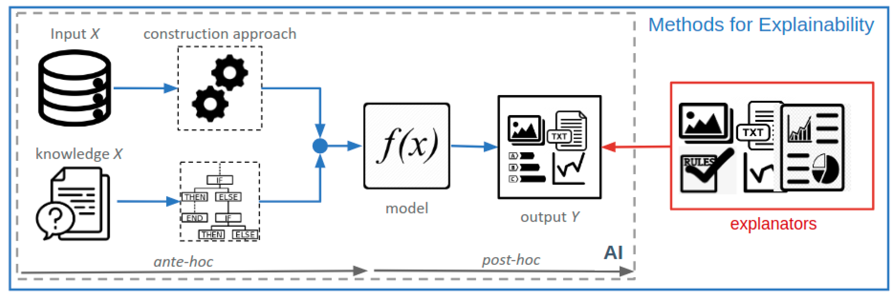

<div align="center">



# 🧠 **XAI-SOMs: Explainable AI using Self-Organizing Maps for Healthcare**

*Visualize, Understand & Validate Patient-Level Insights through Interpretable SOM-based AI Pipelines*

[](https://www.python.org/downloads/)
[](LICENSE)
[](https://github.com/psf/black)

[Features](#features) • [Installation](#installation) • [Usage](#usage) • [Documentation](#documentation) • [Contributing](#contributing)

</div>

---

## 🌟 Overview

**XAI-SOMs** is a modular and interpretable healthcare analytics framework using **Self-Organizing Maps (SOMs)** combined with Explainable AI techniques. It enables medical professionals and researchers to discover **clinically coherent clusters**, derive **individual patient explanations**, and validate the outputs using domain-driven constraints and visualizations.

Built with scalability and real-world deployment in mind, this system supports regulatory reporting, clinical decision dashboards, and interactive data explorations for **transparent medical AI**.

---

## 📚 Dataset - Diabetes Data Set

📎 **Source**: [Diabetes Data Set – Kaggle](https://www.kaggle.com/datasets/mathchi/diabetes-data-set)

The **Diabetes Data Set** is a structured medical dataset containing information on diabetes diagnoses and related features. It is commonly used for binary classification tasks in healthcare ML systems to predict the presence or absence of diabetes.

#### 📁 Dataset Highlights:

* **Total Records**: 1,015 patient records
* **Type**: Tabular (Structured)
* **Task**: Binary Classification — Diabetes (Positive/Negative)

#### ✅ Why This Dataset?

* Rich in **biomedical indicators** that affect diabetes.
* Ideal for **unsupervised learning** tasks like **Self-Organizing Maps (SOMs)** to visualize and cluster patient patterns.
* Suitable for **XAI (Explainable AI)** methods for interpreting model decisions in healthcare.
* Balanced and clean, making it suitable for both beginners and research projects.

> 📌 **Dataset Link**: [https://www.kaggle.com/datasets/mathchi/diabetes-data-set](https://www.kaggle.com/datasets/mathchi/diabetes-data-set)

---

## 🚀 Features of *XAI-SOMs*

* **Self-Organizing Maps for Healthcare**  
  Unsupervised learning to map patients into 2D grid based on medical similarity.

* **Explainability-Driven Analysis**  
  Cluster-level topic modeling, patient feature contributions, and interpretable visualization.

* **Regulatory-Grade Reporting**  
  Automatic PDF/JSON summary reports on patient distributions, clusters, and risks.

* **Medical Coherence Validator**  
  Domain-specific validator to ensure output clusters reflect clinical sense.

* **Comprehensive Logging & Error Tracing**  
  Structured logs using custom logger `test_logger` for better debugging and traceability.

* **Interactive Visualization Tools**  
  Patient journey mapping, heatmaps, and SOM plots for user-driven exploration.

* **Reproducible & Modular Pipeline**  
  Seamlessly plug and play with different encoders, normalizers, SOM grid sizes, or patient features.

---

## 📰 Published Article

🔗 Coming Soon on Medium — *Explaining Clinical AI with XAI-SOMs*

---

## 🛠️ Installation

#### Step 1: Clone the Repository

```bash
git clone https://github.com/priyam-hub/XAI-SOMs.git
cd XAI-SOMs
````

#### Step 2: Setup Environment

```bash
# Run Environment Setup Script
bash env_setup.sh

# Choose Python or Conda environment creation

# Activate the environment before proceeding
```

#### Step 3: Add a `.env` File (Optional for Custom Config)

```bash
# Rename '.sample_env' to '.env' if present
# Add environment variables if needed (e.g., data paths, log level)
```

#### Step 4: Prepare Your Dataset

* Replace the placeholder dataset in `data/` with your own.
* Ensure the file structure matches expected columns like `patient_id`, `age`, `diagnosis`, etc.

#### Step 5: Run the Full Pipeline

```bash
python main.py
```

#### Step 6: Visualize & Validate

* Use logs to trace patient journey and cluster mappings.
* Open generated visualizations in `results/` folder.

---

## 🧰 Technology Stack

**Python** – Core language for the entire pipeline
🔗 [Python Docs](https://www.python.org/doc/)

**Pandas & NumPy** – Data wrangling and numeric analysis
🔗 [Pandas](https://pandas.pydata.org/) | [NumPy](https://numpy.org/)

**Scikit-learn** – For scaling, clustering, NMF topic modeling
🔗 [Scikit-learn](https://scikit-learn.org/)

**MiniSom** – Self-Organizing Map implementation
🔗 [MiniSom GitHub](https://github.com/JustGlowing/minisom)

**Matplotlib / Seaborn** – For plotting and heatmaps
🔗 [Matplotlib](https://matplotlib.org/) | [Seaborn](https://seaborn.pydata.org/)

**Logging** – Custom `test_logger` for consistent monitoring
🔗 [Python Logging](https://docs.python.org/3/library/logging.html)

---

## 📁 Project Structure

```plaintext
XAI-SOMs/
├── .env                            # Env variables (optional)
├── LICENSE                         # MIT License
├── README.md                       # Project documentation
├── env_setup.sh                    # Shell script to setup environment
├── requirements.txt                # Python package dependencies
├── main.py                         # Pipeline runner script
├── logger/
│   └── logger.py                   # Custom logging format setup
├── data/
│   └── healthcare_sample.csv       # Input dataset (replace with real data)
├── results/
│   └── visualizations/             # Plots and charts
│   └── reports/                    # JSON / PDF medical reports
├── src/
│   ├── preprocessor/               # Feature engineering and transformations
│   ├── som_trainer/                # SOM training logic
│   ├── cluster_identifier/         # Cluster mapping and topic modeling
│   ├── validator/                  # Medical coherence validator
│   ├── visualizer/                 # Heatmap, BMU, and patient visualizations
│   ├── report_generator/          # Generate final reports
│   └── utils/                      # Data loaders, helper functions
```

---

## 🔮 Future Work Roadmap

### ⚙️ Phase 1: Dashboard & API (1–2 Weeks)

* Flask-based clinical dashboard for real-time patient cluster analysis
* REST API for integration with EMRs or health platforms
* Upload custom CSVs, view journeys and recommendations interactively

### 🧠 Phase 2: Deep Clinical Knowledge (2–3 Weeks)

* Add support for **ICD codes, medication mapping**, and **treatment outcome tracking**
* Ontology-aware explanations using **UMLS or SNOMED CT**
* Incorporate physician feedback into model outputs

### 🤖 Phase 3: LLMs & Vector Embeddings (3–4 Weeks)

* Use **BioBERT/ClinicalBERT** or `SentenceTransformers` for richer representations
* Store and query using **vector databases** like FAISS/Qdrant
* Natural language explanations via **LangChain + LLaMA 3** style agents

---

## 📜 License

This project is licensed under the **MIT License**. See the [LICENSE](LICENSE) file for full legal terms.

<div align="center">

**Made by Priyam Pal**

🔗 [Visit the Repo](https://github.com/priyam-hub/XAI-SOMs) • ⭐ Star if you find it useful!

</div>
```
